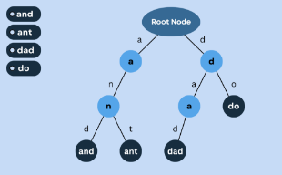
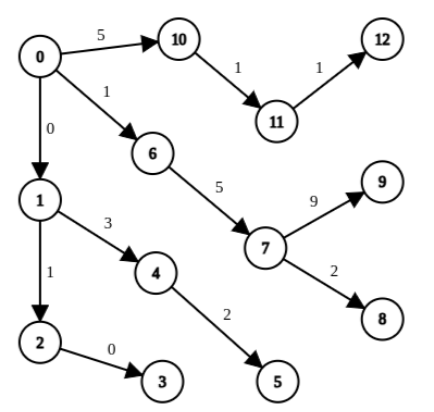
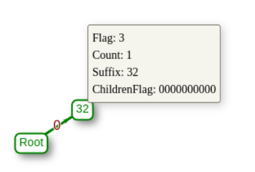
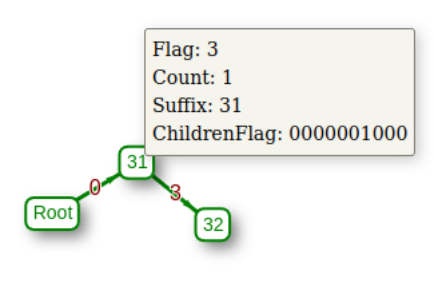
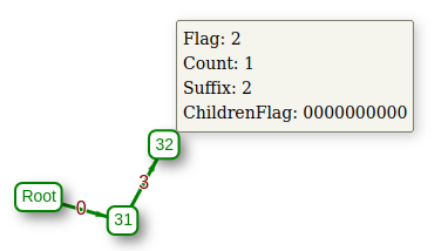
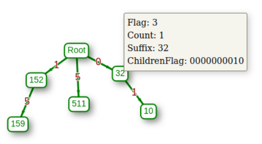
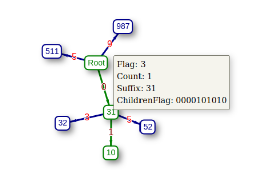
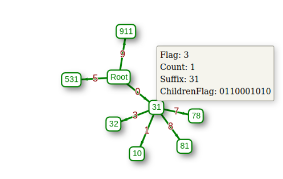

AST-Sort - A sorting algorithm running Depth First Search on Trie data structure with Memory complexity O(n) and Time complexityO(nlogkMaxElement)

Abstract

The paper introduces a sorting approach for integers that leverages Depth First Search on Trie data structure to get enough memory and time efficiency. Building a Trie using the digits of each integer takes O(nlogk n) memory, where n represents the number of elements to be sorted and k signifies the base of the integers. The paper presents a unique idea to compress the memory complexity within O(n). The time complexity of the given approach is O(nlogk n). As the value of k is more than two, this algorithm works better than many other sorting algorithms like Merge Sort, Heap Sort, etc. Also, the best-case time complexity is Ω(n) which is better than algorithms like radix sort. The design of the algorithm, its underlying data structures, and its performance characteristics are all thoroughly exam- ined in this paper. The sorting algorithm’s effectiveness compared to other sorting methods is shown through mathematical proofs and implementation, highlighting its potential to be a useful addition in various application fields where memory efficiency and moderate sorting speed are essential.The paper introduces a novel sorting approach for integers that leverages Depth First Search (DFS) on Trie data structure to achieve both memory and time efficiency. Unlike traditional sorting algorithms, which often require substantial memory allocations or exhibit higher time complexities, the proposed algorithm offers a unique balance between these factors. Constructing a Trie using the digits of each integer incurs a memory complexity of O(nlogk n), where n represents the number of elements to be sorted and k sig- nifies the base of the integers. However, through innovative techniques, the paper demonstrates how to compress the memory complexity within O(n), making the algorithm highly efficient in terms of mem-

ory utilization. Furthermore, the time complexity of the proposed approach is analyzed to be O(nlogk n). Notably, as the value of k exceeds two, the algorithm outperforms many traditional sorting algorithms such as Merge Sort and Heap Sort. Moreover, the best-case time complexity of Ω(n) surpasses that of algorithms like radix sort, showcasing the superior performance of the proposed algorithm under vari- ous scenarios.The paper thoroughly examines the design of the algorithm, including its underlying data structures and performance characteristics. Mathematical proofs and implementation details are pro- vided to demonstrate its effectiveness compared to other sorting methods. The proposed algorithm has the potential to be a valuable addition in various application fields where both memory efficiency and moderate sorting speed are essential.In addition to presenting the algorithmic concept and implementa- tion, the paper also provides resources for further exploration and understanding. A GitHub repository containing the algorithm concept, implemented codes, and input-output datasets is provided. Addition- ally, a live simulation, developed using ReactJS, is offered to illustrate the algorithm step-by-step. The availability of these resources facilitates comprehensive evaluation and adoption of the proposed sorting algorithm. Sorting algorithms are fundamental tools in computer science, utilized in various applications ranging from data processing and indexing to database management and information retrieval. The effi- ciency of sorting algorithms plays a critical role in optimizing the performance of these applications. Traditional sorting techniques such as Merge Sort, Quick Sort, and Heap Sort have been the cornerstone of sorting operations for decades. However, with the increasing demands for handling large datasets and the need for memory-efficient solutions, there arises a necessity for innovative sorting algorithms. Tradi- tional sorting algorithms such as Merge Sort, Quick Sort, and Heap Sort have served as reliable tools for data sorting. While effective, these algorithms often come with inherent trade-offs, particularly in terms of memory usage and time complexity. With the exponential growth of data in various domains such as data analytics, machine learning, and internet applications, there is a pressing need for sorting algo- rithms that can handle large datasets efficiently. The GitHub repository link of the developed algorithm concept, implemented codes, and input-output datasets: gith[ub.com/AST-TheCoder/Sorting-algorithm. ](https://github.com/AST-TheCoder/Sorting-algorithm)A live simulation is created by ReactJS to describe the algorithm step by step. The GitHub reposi- tory link of the simulation UI: [github.com/AST-TheCoder/ast-sort-simulation. The live](https://github.com/AST-TheCoder/ast-sort-simulation) simulation link: [ast-thecoder.github.io/ast-sort-simulation](https://ast-thecoder.github.io/ast-sort-simulation)

1 Introduction

Computer science’s most basic tools, sorting algorithms have a wide range of uses in fields like databases, data analysis, and information retrieval. For sorting algorithms to be useful in practice, their effectiveness must be assessed in terms of both time and memory complexity. In this research, A sorting method is provided that uses a Trie data structure and the Depth First Search (DFS) method. A fascinating alternative to current sorting algorithms, the DFS and Trie structure combination strikes a special balance between memory efficiency and time complexity.

Although traditional sorting algorithms like Merge Sort, Quick Sort, and Heap Sort have shown varied degrees of efficiency, they frequently need significant memory consumption and may fall short in terms of reducing their time complexity. On the other hand, Radix Sort may not be the best option for some datasets even though it can sometimes reach

a better time complexity. The sorting algorithm attempts to close the gap between these complexities by offering an original method to reduce memory requirements to O(n) while maintaining a competitive time complexity of O(nlogkn), where n stands for the number of elements to be sorted and k is the base of the integers.

The use of the Trie data structure, where each node represents a digit in the integers being sorted, is a key component of the technique. This method allows for quick traversal and sorting since it naturally captures the relationships and orderings between the elements. The data hierarchical organization is made by building the Trie using each integer’s digits. This approach should take O(nlogkn) memory classically. But, this paper proposed a way of node compression to minimize the memory complexity to O(n).

Beginning with a thorough examination of the algorithm design and underlying data structures, this study delves into the complexities of the method. Mathematical justifications are provided as the algorithm’s sequential execution is examined to determine its time and memory complexity. Mathematical proofs of the algorithm’s superiority in some situations and comparative tests against traditional sorting algorithms highlight its potential as a useful addition to the field of sorting approaches. The useful advantages of the algorithm are demonstrated by empirical evaluations and implementation, emphasizing its relevance for situations where memory efficiency and moderate sorting speed are of absolute concern.

2 Problem Statement

Sorting is one of the prime necessities in the computer science field. To maintain the database, indexing, queries, crawling, and many other sectors, sorting acts as the main back- bone. Sorting algorithms are fundamental tools in computer science and have widespread applications in various domains, from databases to data analysis and information retrieval.

The efficiency of sorting algorithms is a critical consideration for optimizing the perfor- mance of these applications. Traditional sorting algorithms, while effective in many cases, often come with trade-offs between memory and time complexity.

In this context, the AST-Sort algorithm presents an innovative approach by combining Trie data structures with Depth-First Search (DFS) to achieve a unique balance between memory efficiency and time complexity. This thesis proposal outlines a comprehensive research endeavor to explore the efficiency and applicability of the AST-Sort algorithm. The primary objectives of this research are to analyze the algorithm’s performance charac- teristics, evaluate its effectiveness in comparison to existing sorting methods, and identify potential application domains where it can offer significant advantages.

Sorting algorithms represent a cornerstone of computer science, impacting a wide spec- trum of applications that depend on efficient data organization. In the quest for optimal sorting solutions, striking the right balance between memory usage and computational time has been a perennial challenge. Traditional sorting techniques, though effective in many cases, often require substantial memory allocations or may not always deliver the desired level of time efficiency. In response to these challenges, the AST-Sort algorithm emerges as a promising innovation, offering a new perspective on sorting through the clever integration of Trie data structures and Depth-First Search (DFS) traversal.

The AST-Sort algorithm can potentially revolutionize how we approach sorting tasks. By harnessing the power of Trie structures, where each node corresponds to a digit in the integers being sorted and DFS traversal, AST-Sort efficiently explores and exploits inher- ent hierarchical relationships within the data. This unique synergy between Trie and DFS allows AST-Sort to achieve a memory complexity of O(n), where ’n’ represents the num- ber of elements to be sorted. This reduction in memory overhead is a significant departure from conventional sorting algorithms, which often necessitate larger memory allocations, especially when dealing with large datasets.

Furthermore, the time complexity of AST-Sort is analyzed to be O(nlogkn), where ’k’ denotes the base of the integers involved. Notably, as ’k’ typically exceeds two, AST-Sort demonstrates superior performance compared to many established sorting algorithms, such

as Merge Sort, Heap Sort, and Quick Sort, which have a time complexity of O(nlog2n). Addi- tionally, AST-Sort showcases a best-case time complexity of Ω(n), surpassing algorithms like Radix Sort. This advantageous combination of memory and time efficiency makes AST-Sort

a compelling choice in scenarios where resource constraints and sorting speed are crucial considerations.

In light of these compelling features, this thesis explores AST-Sort comprehensively. By dissecting its underlying principles, conducting rigorous empirical evaluations, and identify- ing its potential applications, we aim to uncover the true extent of AST-Sort’s capabilities and its impact on the landscape of sorting algorithms. This research will contribute to the theoretical understanding of sorting algorithms but also provide practical insights into when and how AST-Sort can be harnessed to address real-world data processing challenges.

3 Objectives

Objectives refer to specific goals or aims that an individual or organization sets out to achieve within a given timeframe. These objectives provide a clear direction and purpose, guiding actions and decisions toward accomplishing desired outcomes.

1. Algorithm Analysis

The AST-Sort algorithm, a novel approach to sorting, warrants a detailed analysis to unveil its design principles, underlying data structures, and mathematical foundations. At the core of AST-Sort lies the clever integration of Trie data structures with Depth-First Search (DFS) traversal, enabling efficient exploration of hierarchical relationships within data. Understanding the intricacies of Trie construction, DFS traversal, and their synergistic relationship is pivotal to grasping AST-Sort’s algorithmic essence. Moreover, elucidating the mathematical underpinnings of AST-Sort’s time and memory complexity is imperative for comprehending its efficiency. By delving into the intricacies of its design and mathematical foundations, this analysis aims to provide a solid theoretical framework for understanding AST-Sort’s functionality and performance characteristics.

2. Performance Evaluation

Empirical evaluation forms a crucial aspect of assessing AST-Sort’s efficacy in practice. Through extensive experimentation, AST-Sort’s performance will be rigorously evaluated and benchmarked against traditional sorting algorithms like Merge Sort, Quick Sort, and Radix Sort. The experimentation process will involve generating diverse datasets, spanning various sizes, distributions, and characteristics, to simulate real-world scenarios. Perfor- mance metrics such as execution time, memory usage, and scalability will be meticulously measured and analyzed. By subjecting AST-Sort to a battery of performance tests, this objective aims to provide empirical evidence of its efficiency and effectiveness in sorting large datasets.

3. Memory Efficiency

The memory efficiency of AST-Sort stands as a hallmark feature, distinguishing it from traditional sorting algorithms. Despite its competitive time complexity, AST-Sort achieves a remarkable memory complexity of O(n) by leveraging Trie data structures. Investigating the mechanisms through which AST-Sort minimizes memory usage while maintaining efficiency is crucial. This objective entails a deep dive into the inner workings of AST-Sort’s memory management strategies, elucidating how it optimizes memory allocation and utilization. By unraveling the secrets behind AST-Sort’s memory efficiency, this analysis seeks to shed light on its novel approach to data organization and storage.

4. Comparative Study

A comparative study forms an integral part of assessing AST-Sort’s strengths and weak- nesses in various contexts. By juxtaposing AST-Sort against traditional sorting algorithms, this study aims to elucidate its comparative advantages and limitations. Through a sys- tematic comparison of performance metrics, such as time complexity, memory usage, and stability, AST-Sort’s efficacy across different dataset types and sizes will be evaluated. Fur- thermore, exploring how AST-Sort fares in scenarios with specific data characteristics or constraints will provide insights into its suitability for diverse applications. By conducting a comprehensive comparative study, this objective aims to provide a nuanced understanding of AST-Sort’s performance and established sorting techniques[1[\].](#_page26_x78.68_y341.14)

5. Real-World Applications

Identifying and exploring real-world application domains where AST-Sort can offer tan- gible benefits is essential for gauging its practical relevance. AST-Sort’s unique combination of memory efficiency and competitive time complexity holds promise for applications such as in-memory databases, data preprocessing, and data analytics. This objective entails delv- ing into specific use cases within these domains and assessing how AST-Sort can address practical challenges. By elucidating AST-Sort’s applicability and potential impact in real- world settings, this exploration aims to uncover opportunities for leveraging its capabilities to enhance data processing and analysis workflows.

Sorting algorithms play a crucial role in various real-world applications across different domains. The ability to efficiently organize and arrange data is essential for improving per- formance, optimizing resource usage, and facilitating faster retrieval and processing. Some common real-world applications of sorting algorithms include:

1. Database Management Systems: Sorting algorithms are extensively used in database systems to organize and retrieve data efficiently. They help in indexing and searching operations, allowing for faster query processing and data retrieval.
1. E-commerce and Online Retail: In e-commerce platforms, sorting algorithms are employed to sort products based on various criteria such as price, popularity, relevance, or user preferences. This enables users to easily find and compare products.
3. Network Routing and Optimization: Sorting algorithms are used in network routing to arrange data packets based on priority, destination, or other parameters. This helps in optimizing data flow and reducing latency.
3. Data Analytics and Business Intelligence: Sorting algorithms are fundamental in data analytics for processing and analyzing vast amounts of data. They aid in tasks such as trend analysis, pattern recognition, and anomaly detection.
3. File Systems and Operating Systems: Sorting algorithms are integral to file systems for organizing files and directories. In operating systems, they assist in managing processes and scheduling tasks based

   on priority.

6. Genomic Sequencing and Bioinformatics: Sorting algorithms are used in genomics for sequencing DNA strands and analyzing genetic data. They help in identifying patterns, mutations, and genetic similarities.
6. Search Engines and Information Retrieval: Sorting algorithms are employed by search engines to rank and display search results based on relevance, popularity, and user preferences. This enhances the user experience and improves search accuracy.
6. Telecommunications and Signal Processing: Sorting algorithms play a role in signal processing applications such as audio and image processing. They assist in organizing and analyzing signals for communication and data transmission.
6. Scientific Computing and Simulation: In scientific research, sorting algorithms are used for data analysis, simulations, and modeling. They aid in organizing and processing experimental data for scientific discoveries.
6. Social Media and Content Recommendation: Sorting algorithms are utilized in social media plat- forms to personalize content feeds and recommend relevant posts, videos, or products based on user preferences and interactions.

These are just a few examples of the diverse applications of sorting algorithms in real- world scenarios. The efficiency, stability, and scalability of sorting algorithms are crucial factors that contribute to the smooth functioning of various systems and applications across industries.

4 Literature Review

Certainly, here is a literature review focusing on sorting algorithms, with an emphasis on memory-efficient and time-efficient techniques leading up to the introduction of AST-Sort.

Sorting algorithms are a fundamental component of computer science and play a piv- otal role in various applications ranging from databases and data analysis to information retrieval and cryptography. The efficiency of sorting algorithms, in terms of both time and memory complexity, has been a subject of extensive research for decades. This literature review provides an overview of traditional sorting algorithms, highlighting their strengths and limitations, leading to the introduction of the novel AST-Sort algorithm.

1. Traditional Sorting Algorithms

Traditional sorting algorithms are fundamental tools in computer science, providing effi- cient methods for arranging data in a specific order. These algorithms have been extensively studied and widely used for decades, offering various approaches to sorting datasets of different sizes and characteristics.

1. Quick Sort

Developed by Tony Hoare in 1960, Quick Sort is known for its efficiency in practice due to its average-case time complexity of O(nlog2n). However, its worst-case time complexity is O(n2), which can be a limitation in certain scenarios. Quick Sort also typically requires a relatively high amount of memory for the call stack[2[\].](#_page26_x78.68_y363.10)

Quick Sort is a widely used sorting algorithm known for its efficiency and versatility. It follows the Divide and Conquer paradigm, where it divides the input array into smaller subarrays, sorts them recursively, and then combines them to produce a sorted array.

The main steps of the Quick Sort algorithm can be described as follows:

1. Partitioning: The algorithm selects a pivot element from the array. The array is then rearranged so that all elements less than the pivot are placed before it, and all elements greater than the pivot are placed after it. This step effectively partitions the array into two subarrays.
1. Recursion: After partitioning, the algorithm recursively applies the same steps to the subarrays on either side of the pivot. Each subarray is partitioned, and the process continues until the subarrays contain only one or zero elements.
1. Combining: Finally, the sorted subarrays are combined to form the fully sorted array. Since the subarrays are sorted in place, no additional merging step is needed.

Quick Sort is known for its efficiency, particularly in average and best-case scenarios. It has a time complexity of O(n logn) in the average case and O(n2) in the worst case. The efficiency of Quick Sort largely depends on the selection of the pivot element. A well-chosen pivot can result in balanced partitions, leading to optimal performance.

One of the key advantages of Quick Sort is its in-place sorting, meaning it doesn’t require additional memory aside from the stack space used for recursion. This makes it more memory-efficient than algorithms like Merge Sort.

However, Quick Sort’s worst-case time complexity of O(n2) occurs when the pivot selec- tion results in highly unbalanced partitions, such as when the array is already sorted or nearly sorted. To mitigate this, various optimizations can be implemented, such as selecting the median-of-three as the pivot or using randomized pivot selection.

In summary, Quick Sort is a highly efficient and versatile sorting algorithm that divides the input array into smaller partitions, sorts them recursively, and combines them to produce a sorted array. While its average-case time complexity of O(n logn) makes it one of the fastest sorting algorithms available, its worst-case time complexity and sensitivity to pivot selection are considerations in certain scenarios. Overall, Quick Sort’s balance of efficiency and in-place sorting makes it a popular choice for various sorting applications.

2. Merge Sort

Merge Sort offers consistent O(nlog2n) time complexity but often demands additional memory for temporary storage during the merging process. This additional memory consumption can be a drawback when sorting large datasets[3].

Merge Sort is a well-known sorting algorithm that follows the Divide and Conquer paradigm. It is renowned for its stable and efficient sorting performance, particularly for large datasets. The algorithm operates by recursively dividing the input array into smaller subarrays until each subarray consists of one or zero elements, which are inherently sorted. It then merges these sorted subarrays back together to produce a fully sorted array.

The main steps of the Merge Sort algorithm can be described as follows:

1. Divide: The input array is divided into two halves, and this process continues recursively until each subarray contains one or zero elements. This division is key to the Divide and Conquer approach, as it breaks down the sorting problem into simpler subproblems.
1. Conquer: Once the array is divided into individual elements or small subarrays, the merging process begins. Pairs of adjacent subarrays are merged together, creating larger sorted subarrays.
1. Merge: During the merge phase, the sorted subarrays are combined to form larger sorted subarrays. This merging process involves comparing elements from each subarray and placing them in the correct order in a temporary array. As elements are merged, the temporary array is copied back to the original array.

The Merge Sort algorithm is characterized by its efficiency and stability. Efficiency-wise, Merge Sort has a time complexity of O(n logn) in all cases, making it one of the most efficient sorting algorithms available. This time complexity remains consistent even for large datasets, as the algorithm consistently divides the input array into halves, reducing the problem size logarithmically.

Additionally, Merge Sort is a stable sorting algorithm, meaning it maintains the relative order of equal elements in the sorted array. This stability ensures that elements with the same value will retain their original order, which can be important in certain applications.

Although Merge Sort has excellent time complexity and stability, it does come with the drawback of requiring additional memory space. The merging process involves creating temporary arrays to hold the sorted subarrays during the merge phase. As a result, the algorithm has a space complexity of O(n), where n is the number of elements in the input array. This extra memory usage can be a consideration when working with extremely large datasets or in memory-constrained environments.

In summary, Merge Sort is a highly efficient and stable sorting algorithm that divides the input array into smaller subarrays, sorts them individually, and then merges them back together to produce a fully sorted array. While it boasts a consistent time complexity of O(n logn), its space complexity of O(n) for the temporary arrays can be a consideration in certain scenarios. Overall, Merge Sort’s balance of efficiency and stability makes it a popular choice for sorting applications where performance is crucial.

3. Heap Sort

Heap Sort achieves O(nlog2n) time complexity and is an in-place sorting algorithm, meaning it doesn’t require additional memory. However, its constant factors can make it less efficient in practice than some other algorithms[4[\].](#_page26_x78.68_y431.03)

Heap Sort is a comparison-based sorting algorithm known for its efficiency and simplicity. It utilizes the properties of a binary heap data structure to efficiently sort elements in place.

The main steps of the Heap Sort algorithm can be described as follows:

1. Build Heap: The algorithm starts by building a max heap from the input array. This involves arranging the elements in the array such that each parent node is greater than or equal to its children. The max heap property ensures that the maximum element is at the root.
1. Heapify: Once the max heap is built, the largest element (at the root) is swapped with the last element in the array. This effectively places the largest element at its correct position in the sorted array. The heap property is then restored for the remaining elements by performing a ”heapify” operation on the root node.
1. Repeat: Steps 2 and 3 are repeated for the remaining elements in the heap, gradually reducing the size of the heap until all elements are sorted.

Heap Sort has a time complexity of O(n logn) in all cases, making it a highly efficient sorting algorithm. It achieves this by leveraging the properties of the heap data structure, particularly the ability to extract the maximum element in constant time and maintain the

heap property in logarithmic time.

One of the key advantages of Heap Sort is its in-place sorting, meaning it doesn’t require additional memory aside from the original array. This makes it memory-efficient compared

to algorithms like Merge Sort.

However, Heap Sort is not stable, meaning it does not preserve the relative order of equal elements in the sorted array. Additionally, its main drawback is its relatively high constant factors compared to other O(n logn) sorting algorithms.

In summary, Heap Sort is a highly efficient sorting algorithm that utilizes the properties

of a binary heap to sort elements in place. With a time complexity of O(n logn) in all cases and in-place sorting, Heap Sort is a popular choice for scenarios where both efficiency and memory usage are important considerations.

4. Radix Sort

Radix Sort can achieve linear time complexity O(nlogkMaxE lement) in some cases, where ’k’ is the number of digits in the numbers being sorted. It is especially efficient for sorting integers with a limited range of values. However, it can require additional memory when dealing with large datasets[5[\].](#_page26_x78.68_y464.99)

Radix Sort is a non-comparison based sorting algorithm that works on integers by group- ing digits and sorting them from the least significant digit (LSD) to the most significant digit (MSD) or vice versa. It is known for its linear time complexity and is particularly effective for sorting integers of fixed length.

The main steps of the Radix Sort algorithm can be described as follows:

1. Digit-wise Sorting: Radix Sort processes the input array one digit at a time, starting from the least significant digit (LSD) to the most significant digit (MSD) or vice versa. For each digit position, the algorithm sorts the elements into buckets based on the value of the current digit.
1. Bucket Sorting: After sorting the elements based on each digit, Radix Sort combines the elements from all buckets to form a new array. This process is repeated for each digit position until all digits have been considered.
1. Final Sorted Array: After processing all digit positions, the array is fully sorted, with elements arranged in ascending or descending order based on the chosen digit order.

Radix Sort has a time complexity of O(nk), where n is the number of elements in the array and k is the number of digits in the longest element. In cases where k is a constant or small compared to n, Radix Sort exhibits linear time complexity, making it highly efficient for sorting integers.

One of the key advantages of Radix Sort is its stability, meaning it preserves the relative order of equal elements in the sorted array. This makes Radix Sort particularly useful in scenarios where stability is important, such as sorting objects with multiple keys.

However, Radix Sort requires additional memory space for creating the buckets and temporary arrays during sorting. The space complexity of Radix Sort is O(n + k), where n is the number of elements and k is the number of buckets. For large k values, this can impact the algorithm’s memory usage.

In summary, Radix Sort is an efficient non-comparison based sorting algorithm that sorts integers by processing digits from the least significant to the most significant or vice versa. With a time complexity of O(nk) and stability, Radix Sort is a popular choice for sorting fixed-length integers, particularly when efficiency and stability are important considerations.

2. Memory-Efficient Sorting Algorithms

Memory-efficient sorting algorithms prioritize minimizing memory usage while maintain- ing reasonable time complexity. These algorithms are crucial for scenarios where memory resources are limited or when sorting large datasets.

Memory-efficient sorting algorithms refer to techniques that optimize the use of memory resources during the sorting process. These algorithms aim to minimize the amount of additional memory space required beyond the input array itself. This becomes particularly important when dealing with large datasets or in memory-constrained environments.

Memory efficiency in sorting algorithms can be achieved through various strategies:

1. In-place Sorting: Algorithms that perform sorting directly on the input array without requiring addi- tional memory space for temporary arrays or buffers are considered in-place sorting algorithms. Examples include Heap Sort and Quick Sort. In-place sorting algorithms have a space complexity of O(1) since they do not use extra memory proportional to the size of the input.
1. Limited Auxiliary Storage: Some sorting algorithms may use a limited amount of additional memory

   for bookkeeping or control purposes, but the amount of extra memory is independent of the input size. An example is the Radix Sort algorithm, which uses buckets for organizing elements during sorting.

3. Optimized Data Structures: Sorting algorithms that utilize efficient data structures can also con- tribute to memory efficiency. For instance, algorithms like Counting Sort and Bucket Sort use arrays or linked lists to organize elements, minimizing the need for large temporary arrays.
3. Inherent Memory Efficiency: Certain algorithms naturally have better memory efficiency due to their design principles. For example, Merge Sort requires additional memory for its merging step but has a predictable and controlled memory usage pattern.

In summary, memory-efficient sorting algorithms are those that aim to minimize the amount of additional memory space needed beyond the input array. They achieve this

through various strategies such as in-place sorting, limited auxiliary storage, optimized data structures, and inherent memory efficiency. These algorithms are particularly beneficial in scenarios where memory resources are limited or where minimizing memory overhead is a priority.

1. External Sorting

In situations where the dataset does not fit entirely in memory, external sorting algo- rithms like External Merge Sort and Polyphase Sort are employed. They optimize the use of external storage (e.g., disk drives) to minimize the amount of data that needs to be loaded into memory at any given time[6[\].](#_page26_x78.68_y498.95)

2. In-Place Sorting Algorithms

In-place sorting algorithms like Bubble Sort, Selection Sort, and Insertion Sort prioritize memory efficiency by not requiring additional memory allocations for sorting. However, their time complexity can be less favorable, typically O(n2)[[7\].](#_page26_x78.68_y532.92)

3. Simmilarities with AST-Sort

The AST-Sort algorithm, introduced in this research, offers a fresh perspective on sorting algorithms by leveraging Trie data structures and Depth-First Search (DFS). The use of Trie structures allows AST-Sort to capture hierarchical relationships within the data, facilitating efficient sorting while maintaining a memory complexity of O(n). This reduction in memory usage is a significant departure from many traditional sorting algorithms[8].

Furthermore, AST-Sort’s time complexity of O(nlogkn) positions it as a competitive alter- native to existing sorting techniques. As ’k’ often exceeds two, this algorithm outperforms many traditional sorting methods, particularly in scenarios where both memory efficiency and sorting speed are essential considerations.

In summary, traditional sorting algorithms have their strengths and weaknesses, often trading off memory and time efficiency. The introduction of AST-Sort addresses this chal- lenge by providing a unique approach that combines Trie data structures with DFS, promising both memory-efficient and time-efficient sorting, opening up new possibilities in various data processing applications. This thesis aims to delve deeper into the exploration and evaluation of AST-Sort’s capabilities and practical applications.

5 Pre-Requisites

Prerequisites refer to the conditions, requirements, or qualifications that must be met or fulfilled before undertaking a particular task, activity, or course of action. These prerequisites are essential for ensuring that individuals or entities have the necessary knowledge, skills, resources, or permissions needed to successfully engage in the intended activity or pursue a specific goal. We need to know the Trie data structure, Depth First Search algorithm, and Lexicographical sorting.

1. Trie Data Structure

A Trie, also known as a prefix tree, is a tree-like data structure used for efficiently storing and retrieving a dynamic set of strings or keys. In a Trie, each node represents a single character of the keys being stored. The structure of the Trie allows for rapid searching and retrieval of strings by traversing down the tree from the root node to the leaf nodes, with each edge representing a character in the string. Tries are particularly useful for tasks such as auto- complete, spell-checking, and dictionary implementations due to their efficient prefix-based searching capabilities. The algorithm of the Trie data structure is written below[9].

A Trie, also known as a prefix tree, is a tree-like data structure used for efficient retrieval of keys in a dataset of strings or sequences. It is particularly suited for tasks such as autocom- plete suggestions, dictionary implementations, and prefix-based searching. The name ”Trie” comes from the word ”retrieval,” indicating its primary purpose of facilitating efficient key retrieval.

The Trie data structure organizes keys in a tree-like format, where each node represents a single character of a key. The path from the root node to a leaf node represents a key in the dataset. This characteristic allows for fast searching, insertion, and deletion operations with a time complexity proportional to the length of the key.

The main properties of a Trie are as follows:

- Root Node: The Trie always starts with a root node, typically representing an empty string or null value.
- Child Nodes: Each node in the Trie has links to its child nodes, each corresponding to a unique character in the alphabet or set of possible characters. This allows for efficient traversal through the Trie based on the characters of the keys.
- Leaf Nodes: Leaf nodes in the Trie represent the end of a key. They do not store any character but serve as markers indicating that a complete key has been inserted.
- Prefix Matching: One of the key advantages of the Trie is its ability to efficiently perform prefix matching. Given a prefix, the Trie can quickly retrieve all keys that start with that prefix by traversing the corresponding subtree.
- Space Efficiency: While Trie offers fast retrieval and insertion operations, it can consume more memory compared to other data structures due to the storage of individual characters at each node. However, techniques such as compression can be applied to reduce memory usage.
- Applications: The Trie data structure finds applications in various real-world scenarios:
- Autocomplete and Spell Checking: Tries are commonly used in autocomplete systems to suggest words or phrases based on partial input. They are also utilized in spell-checking algorithms to quickly identify misspelled words and suggest corrections.
- Dictionary Implementations: Tries serve as an efficient way to store and retrieve words in dictionary applications. The structure allows for quick lookups of words and their definitions.
- IP Routing Tables: In networking, Tries are used to store IP addresses for efficient routing. The structure allows routers to quickly determine the next hop for a given IP address.
- Searching and Retrieval: Tries are used in search engines and databases for fast searching and retrieval of strings. They can efficiently locate records based on prefixes or partial matches.
- Text Processing: Tries can be employed in text processing tasks such as finding common prefixes in a set of strings, generating suggestions for typing errors, or identifying keywords in documents.
- Genomic Sequencing: In bioinformatics, Tries are used for storing and searching DNA sequences. They facilitate quick comparisons and analysis of genetic data.

In summary, the Trie data structure offers efficient key retrieval operations, particularly for prefix-based searches. While it may consume more memory compared to other structures, its speed and versatility make it a valuable tool in a wide range of applications, from autocomplete systems to networking and bioinformatics.

Algorithm 1 Trie Data Structure Data: Root node of the Trie Result: Trie data structure

Function Insert(root, word ):

currentNode ← root for each character c in word do

if currentNode does not have a child for character c then

 Create a new TrieNode and add it as a child of currentNode for character c

end

Move currentNode to its child for character c

end

Set the isEndOfWord flag of the last node to true

Function Search(root, word ):

currentNode ← root for each character c in word do

if currentNode does not have a child for character c then

return false

end

Move currentNode to its child for character c

end

return true if currentNode’s isEndOfWord flag is true, else false

Time Complexity of the operations performed in the Trie. Insert operation: O(n)

Search operation: O(n)

2. Depth First Search

Depth-first search (DFS) is a graph traversal algorithm used to explore and navigate through graphs and trees. It starts at a selected node (often the root node) and explores as far as possible along each branch before backtracking.

DFS operates by visiting the neighboring vertices of the current vertex recursively until it reaches a leaf node or a node with no unvisited neighbors. It then backtracks to the nearest unexplored node and continues the process until all nodes have been visited.

DFS is commonly implemented using a stack data structure or recursion. It is often used in various applications, including pathfinding, cycle detection, topological sorting, and graph analysis. DFS can be easily implemented and is particularly useful for traversing deep paths in graphs or trees efficiently. However, it may not guarantee the shortest path and can encounter issues such as infinite loops if not properly managed[10[\].](#_page26_x73.70_y634.80)

Depth First Search (DFS) is a fundamental graph traversal algorithm that explores as far as possible along each branch before backtracking. It is one of the most fundamental algorithms used in graph theory and is widely employed in various applications such as pathfinding, cycle detection, topological sorting, and more.

1. Algorithm Overview

The DFS algorithm can be described as follows:

1. Start: Begin with an initial vertex as the starting point.
1. Explore: Visit the adjacent unvisited vertex that is adjacent to the current vertex. Mark it as visited and move to this new vertex.
1. Recursion: If there are multiple unvisited vertices adjacent to the current vertex, choose one and recursively repeat steps 2 and 3.
1. Backtrack: If no unvisited adjacent vertices remain, backtrack to the previous vertex and continue exploration until all vertices are visited.
2. Implementation

The DFS algorithm can be implemented using either iterative or recursive approaches. In the recursive implementation, a recursive function is called to explore each unvisited neighbor of a vertex. The iterative implementation uses a stack to keep track of vertices to visit, mimicking the recursive call stack.

3. Applications

DFS finds applications in various fields:

- Pathfinding: DFS is used to find paths between two nodes in a graph, such as in maze-solving algorithms.
- Cycle Detection: By keeping track of visited nodes, DFS can detect cycles in a graph. This is useful in network routing and deadlock detection.
- Topological Sorting: DFS can be used to perform a topological sort on a directed acyclic graph (DAG), which is useful in scheduling tasks with dependencies.
- Connected Components: DFS can identify connected components in an undirected graph, essential in network analysis and social network analysis.
- Strongly Connected Components: For directed graphs, DFS can identify strongly connected components, providing insights into graph structure.
4. Complexity Analysis

The time complexity of DFS is O(V+ E), where V is the number of vertices and E is the number of edges in the graph. This is because each vertex and edge is visited once. The space complexity of DFS is O(V) for the recursive implementation due to the call stack depth.

In conclusion, Depth First Search (DFS) is a versatile and fundamental graph traversal algorithm with applications ranging from pathfinding to cycle detection and topological sorting. Its simplicity, along with its efficiency in certain scenarios, makes it a valuable tool

in graph theory and various real-world applications.

Algorithm 2 Depth First Search Data: Graph G and starting vertex v Result: Visited vertices in DFS order

Function DFS(G, v):

Mark v as visited Print v for each adjacent vertex u of v do

if u is not visited then

DFS(G, u)

end

end

Function DFSTraversal(G):

Initialize an array visited to keep track of visited vertices for each vertex v in G do

if v is not visited then

DFS(G, v)

end

end

Time Complexity of the operations performed in the Depth First Search is O(G).

3. Lexicographical Sort

Lexicographical sorting, also known as dictionary order or alphabetical order, is a sorting method where strings or elements are arranged based on the order of their characters, similar to how words are sorted in a dictionary. In lexicographical sorting, the first characters of the strings are compared. If they are equal, the comparison moves to the next character, and so on, until a difference is found or one of the strings ends[[11\].](#_page26_x73.70_y668.77)

The lexicographical order follows the natural order of characters based on their ASCII or Unicode values. In ASCII order, uppercase letters come before lowercase letters, and digits come before letters. For example, in lexicographical order, ”apple” comes before ”banana” because ’a’ comes before ’b’ in the alphabet.

Lexicographical sorting is commonly used in various applications such as dictionary implementations, string manipulation, and data analysis, where ordering based on character sequences is required.

Lexicographical sorting, also known as dictionary order or alphabetical order, is a method of arranging elements based on their dictionary order or the order of characters in an alphabet. This type of sorting is commonly used for strings or sequences of characters.

The main principle behind lexicographical sorting is to compare elements character by character from left to right. The sorting process starts by comparing the first character of each element. If the characters are the same, the comparison moves to the next character. This process continues until a difference is found, or one of the strings ends.

When comparing strings, the lexicographical order follows the natural ordering of charac- ters in the underlying character set. For example, in the ASCII character set, the characters are ordered as follows: ’A’ ¡ ’B’ ¡ ... ¡ ’Z’ ¡ ’a’ ¡ ’b’ ¡ ... ¡ ’z’.

In lexicographical sorting, uppercase letters are considered to come before lowercase letters. For example, ”Apple” would come before ”apple” in lexicographical order.

For strings of different lengths, the shorter string is considered to be lexicographically smaller if all of its characters match the corresponding characters of the longer string, and the extra characters of the longer string are larger in value.

Lexicographical sorting has various real-world applications, particularly in text processing and string manipulation tasks. Some common applications include:

1. Dictionary Sorting: Lexicographical sorting is used to arrange words in a dictionary

or glossary. This allows users to quickly locate words and information.

2. String Comparison: In programming, lexicographical sorting is used for comparing and

sorting strings of characters. This is essential for tasks such as sorting filenames, organizing text data, or implementing search algorithms.

3. Alphanumeric Sorting: Lexicographical sorting is also used for sorting alphanumeric

strings, which contain both letters and numbers. This is common in organizing file names, log entries, or database records.

4. Text Processing: Applications that involve processing and analyzing text often use

lexicographical sorting. This includes tasks such as spell-checking, autocomplete suggestions, and search engine indexing.

5. Data Structures: Lexicographical sorting is used in various data structures, such as

balanced binary search trees (e.g., AVL trees, Red-Black trees) and trie structures. These data structures rely on lexicographical ordering for efficient search and retrieval operations.

In conclusion, lexicographical sorting is a fundamental method of arranging elements based on their dictionary order or character sequence. It is widely used in text processing, string manipulation, data organization, and various programming tasks. Understanding lex- icographical sorting principles is essential for efficient handling of strings and implementing algorithms that rely on ordered data.

6 Methodology

Provide a detailed description of the AST-Sort algorithm, outlining its underlying prin- ciples, design considerations, and key features. Explain how AST-Sort leverages Depth First Search (DFS) on Trie data structures to achieve its objectives of memory efficiency and time complexity optimization. At first, the way to have lexicographically sorted strings using Trie has been explained.

”add”, ”do”, ”ant” and ”dad” are some strings that need to be sorted. The Trie built using these strings will look like Fig.1

Fig. 1: Trie data structure implemented on some strings

Now, start traversing on the tree and explore the low-cost edge first. Run the depth-first search and check for the end of the strings like the blue nodes in Fig. 1. Whenever a string is fully traversed, push it to the sorted list. The list will be ”add”, ”ant”, ”dad” and ”do”.This

is the way to sort strings lexicographically with O( |stringi|) complexity where |stringi| means the length of the ith string. We can use the same idea to sort integers also.

1. Integer Sorting using Trie

Traverse on the integers from the left-hand side to the right-hand side. If the number of digits is not the same for all integers, append leading zeroes. Then, insert them into the Trie. Consider some integers - 152, 511, 159, 10 and 32. Make the length of them the same appending leading zeroes and build the Trie. The Trie will look like Fig. 2

As they are having same length, they will maintain the characteristics of being lexico- graphically sorted. So, if the Trie is traversed exploring the low-cost edge first, the extracted list will be sorted. The output will be 010, 032, 152, 159 and 511. However, this approach is not memory efficient.

2. Issue One: High Memory Complexity

Consider that the input data is k− based integers. The maximum element, maxElement of the input data will contain logkmaxElement digits. Suppose, each integer contains a different prefix. The starting nodes are being branched for most of the cases. If, the input data contains n integers then the memory complexity stands to O(nlogkmaxElement) which should be heavy for the ALU.

3. Solution of Issue One: High Memory Complexity

This is the first observation to make the algorithm more efficient. At first, start inserting an integer into the Trie from root to depth. In the Trie, one integer is being split until all digits are set. More formally, considering 032, the traversing path is 0− > 1− > 4− > 5.

At node 1, The edge contains the digit 0 and the remaining suffix is 32.

At node 4, The edge contains the digit 3 and the remaining suffix is 2.

At node 5, The edge contains the digit 2 and the remaining suffix is NULL.

Fig. 2: Trie data structure implemented on some Integers

Now, the updated idea is not to append all the digits every time. Each integer will start to traverse from the root node to the depth. But, whenever it creates a new node, the remaining suffix will be assigned to the node and it stops traversing shown in Fig. 3

Fig. 3: Compressed Trie

Fig. 3 shows that the integer 032 is being appended to the very first node created with the suffix 32. And also the first digit of the suffix will be assigned as a flag of the node. This flag will help to compare the data that are coming next. Consider, 031 is being tried to be

appended after 032. To maintain the characteristics of DFS for extracting the sorted list, 031 has to be appended before 032. To solve this we can flow the data comparing flags.

After appending 032, the Trie looks like Root− > 32 with flag 3. At the time of appending a new integer, compare the flag with the first digit of the integer suffix at each node. If it’s not equal to the flag, then move on. Otherwise, compare the suffixes. Save the lower suffix to the current node and move on propagating the higher one as shown in Fig. 4

Fig. 4: Swapping current node with saved one

In Fig. 4 031 comes to the node 32 and compares their flags. Here both of the flags are the same. Then, being compared 32 and 31, 31 occupies the current position and 32 has been started exploring a new node to be saved.

It is possible to have the same integer more than once in the input data. In that case, both the remaining suffix and the saved suffix will be the same. Now, it will be redundant if one suffix is saved and the other one is moved on. So, each node will contain a count value to keep track of the frequency. In that case, the value of count also has to be propagated to the next node if the saved suffix needs to be moved as in Fig. 5.

Depending on this method, the number of nodes will be the same as the number of input data. So the memory complexity becomes O(n) from O(nlogkmaxElement) which is the same as similar well-known sorting algorithms. The Trie will look like Fig. 6 after inserting 152, 511, 159, 10, and 32 into the Trie.

4. Depth First Search

Depth First Search algorithm will be implemented on the Trie to extract the actual sorted list of integers. We have to search the edge with the lowest cost first. If the cost of the edge is less than the flag of the current node, then traverse them first. Otherwise, insert the value of the current node into the sorted list Count number of times and then traverse the nodes.

Fig. 5: Count Variable Demo

Fig. 6: The Trie after inserting all integers

At the time of running DFS, standing on the node 31 in Fig. 7, the edge with the lowest cost is 1. The flag of node 32 is 3. As the cost of the edge is less than the flag, DFS will traverse the node 10 first and insert it into the sorted list.

The next edge with the lowest cost is 3. This is equal to the flag of the current node. Then before visiting the node 32, 31 has to be pushed into the sorted list. As the value of Count is 1, 31 will be pushed just once into the sorted list. After inserting 31 into the sorted list, node 32 will be traversed and will be inserted. Node 52 will be inserted then. Similarly, nodes 511, and 987 will be inserted respectively. The sorted list will be - 10, 31, 32, 52, 511, and 987. Normally, Depth First Search traverses the edges randomly. However, the algorithm has to maintain the condition of searching the edges from low to high cost. This can change the complexity of Depth First Search.

5. Issue Two: Time Complexity of Depth First Search

In general, the time complexity of DFS is O(V + E), where V is the number of vertices and E is the number of edges. Whenever the graph is a tree, the number of vertices is almost

Fig. 7: Running DFS

equal to the number of edges. The mathematical relation is V = E + 1. The complexity is O(V) of running DFS on a tree then.

In this algorithm, the edge with low cost has to be found for traversing the edges in sorted order. So, the easiest solution is to check for all possible costs starting from 0 to k for the k − based integers. Consider that the Trie contains n nodes. To search the children of each node, a loop has to be run for k times. So, the time complexity of running Depth First Search becomes O(nk). Which is not as efficient as expected.

6. Equation of Searching Lowest Significant Set Bit

Before jumping into the solution, the way to search for the lowest significant set bit has to be explored. The lowest significant set bit means the lowest significant bit of an integer value which is 1. Let value = (1001001010)2, then the 1st bit from the right-hand side can be called the lowest significant set bit if the bits are 0 − indexed.

twosComplemnt = −value      mask = value & twosComplement index = log2mask

From the equations above, the index of the lowest significant set bit can be found. Consider the previous example,

value = (1001001010)2

Then, the value of twosComplement will be,

twosComplement = (01110110110)2

After, performing bitwise and between value and twosComplement, mask will contain only one set bit.

mask = (1001001010)2 & (01110110110)2 = (00000000010)2 = (2)10

After calculating 2 − based logarithm, the index of the lowest significant set bit can be extracted.

index = log22 = 1

It means the 1st bit of value is 1. To find the next significant set bit, subtract mask from value, and follow the steps respectively.

7. Solution of Issue Two: Time Complexity of Depth First Search

Keep a Children flag in each node. The value of the Children flag will maintain the range of (0, 2k − 1). It means the Children flag will contain k bits always. Each bit will indicate a digit in sorted order of k − based integer. More formally, 0th bit indicates the digit 0 and (k − 1)th bit indicates the digit k − 1. The bits between them indicate other bits in sorted order. The Children flag is shown in Fig. 8

Fig. 8: The Trie with multiple Children

In the Children flag, if ith bit is set, then the node has an edge with cost i. Otherwise, the node does not have the edge with cost i. Using the equation of finding the lowest significant set bit, the existing edges can be explored directly in the sorted order without checking all

of the possible edges.

In Fig. 8, node 31 contains the Children flag 0110001010. It means the node contains the edges with costs 1, 3, 7, and 8. Implementing the equations of having the index of the lowest significant set bit, the costs of edges can be extracted directly.

After each iteration, one new node will be explored always. If the Trie contains n nodes, then exactly n iteration is needed to traverse all of the nodes. So, the complexity becomes O(n). Running the DFS maintaining these conditions, the sorted output list can be gained.

7 Algorithm

An algorithm is a step-by-step procedure or set of rules for solving a problem or accom- plishing a task. In computer science, algorithms are often used to describe a finite sequence of well-defined instructions that a computer program can execute to achieve a particular goal. Algorithms can range from simple processes like adding numbers or sorting a list to complex computations such as image recognition or language translation.

The step-by-step described algorithm:

- Build a structure of node containing the suffixV alue , count , childrenFlag , suffixLength , flag , and child pointer.
- Function buildTrie (root, arr [], n, valLength )
- For i from 0 to n − 1:
- If arr [i] = 0, set root− > flag = 0, and increase root− > Count by 1.
- Else While length ! = 0
- Calculate cost of edge which is the most significant digit of the current suffix .
- Calculate new suffix excluding the cost from current suffix .
- If the edge with the cost is not created yet from current node, create a child[cost] node. Update the childrenFlag of the current node performing bitwise or with (1 << cost). Assign the suffixV alue, sufixLength, count, and flag to the new node.
- Else if the suffix is same as the suffix of current node, then increase the count of the current node.
- Else if the suffix is less than the suffix of current node, then swap the suffix with currentNode− > suffix and count with currentNode− > count.
- Else keep everything the same as calculated yet.
- Divide length by 10.
- Function sortArrayByDFS (root, arr [], prefix )
- While (root− > childrenFlag) has set bit
- Calculate lowestSignificantSetBit using equation

root− > childrenFlag&(−(root− > childrenFlag))

- Calculate index of lowestSignificantSetBit using log2(lowestSignificantSetBit)
- If root− > flag < = index , insert prefix ∗currentNode − > length + currentNode − > suffix in to the sorted array count times.
- Recursive call sortArrayByDFS (root− > child [index ],arr,prefix ∗10 + index )
- (root− > childrenFlag) is empty, insert prefix ∗currentNode− > length + currentNode− > suffix in to the sorted array count times.
- Function astSort
- Find the length of the maxV alue.
- Create root node of the Trie.
- Call buildTrie(root, ,arr, n, valLenghth)
- Call sortArrayByDFS(root, arr, 0)

The sorted array will be saved into arr[]. 8 Pseudocode

The pseudocode of the algorithm:

01 nextindex = 0

02 struct node {

3  suffix =0, length=0, count=0, children flag =0, flag= −1
3  node∗∗ child

05 }

06 void build trie (node ∗ root , arr [] , n, val length ) { 07 for ( i = 0; i < n; i++){ 08 node∗ current node = root

09 value = arr [ i ] , length = val length , count = 1

10 if (! value ){

11 current node−> flag = 0

12 current node−>count++

13 continue

14 }

15 while ( length ) {

16 cost = value / length

17 suffix = value % length

18 length /= 10

19 if (!( current node−> children flag & (1 << cost ))) { 20 current node−> child [ cost ] = new node()

21 current node−> children flag |= (1 << cost )

22 current node = current node−> child [ cost ]

23 current node−> length = 10 ∗ length

24 current node−> suffix = suffix

25 current node−>count = Count

26 if ( length ) current node−> flag = value/length 27 else current node−> flag = 0

28 break

29 }

30 current node = current node−> child [(1 << cost )] 31 if ( current node−> suffix == suffix ) {

32 current node−>count++

33 break

34 }

35 if ( length && current node−> flag == value / length

&& suffix < current node−> value ) {

36 swap( current node−> suffix , suffix )

37 swap( current node−>count , count)

38 }

39 } 40 } 41 }

42 void sort arr (node ∗ root , arr [] , prefix ) { 43 while (root −> children flag ){

44 lowestsignificant set bit = (root −> children flag

& (− (root −> children flag )))

45 index = log 2 ( lowestsignificant setbit )

46 root −> children flag −= lowest significant setbit

47 if (root −> flag <= index && root −>count > 0){

48 value = prefix ∗ root −> length + root −> suffix

49 while (root −>count > 0){

50 root −>count −−

51 arr [ next index++] = value

52 }

53 }

54 sortarr (root −> child [ index ] , arr , prefix ∗ 10 + index) 55 } 56 if (root −> length ) value = prefix ∗ root −> length + root −> suffix

57  else value = prefix
57  while (root −>count > 0){

59 root −>count −−

60 arr [ next index++] = value 61 } 62 }

63 void ast sort ( arr [] , n) {

64  node∗ root=new node()
64  max value=0, val length=1
64  for ( i = 0; i < n; i++)

67 max value = max(max value , arr [ i ]) ![ref1]![ref1]68 while (max value) { 69 max value /= 10

70 if (max value) val length ∗= 10

71  }
71  buildtrie (root , arr , n, val length )
71  sortarr (root , arr , 0)

74 }

9 Complexity Analysis

The complexity has been counted depending on the pseudocode written above. It contains two major functions to build the Trie and traversing on the nodes. Complexity has been counted for each major segment of the functions.

1. Time Complexity: Worst Case

If the input data does not contain enough similar prefixes, then we can consider the scenario as worst-case.

1. Function: Build Trie

At line 7, one loop has been running to iterate on all the integers in the array. The time complexity is T(n).

At line 8 and line 9, create temporary variables like currentNode, value, length, and count. Both of the lines are being executed within T(1).

From line 10 to line 14, check the value whether it is 0. If it is, then insert the value to the root and continue the loop. All of these lines are being executed within T(1).

At line 15, a loop is being iterated till the value of length is 0. Basically, the value of length is equal to klogk MaxElement. The length is divided by k at each iteration. On behalf of this condition, the loop will be iterated logkMaxElement times. So, the complexity will be T(logkMaxElement).

From line 16 to line 18, count the cost of edge, suffix of the new node, and divide the length by k. All of the lines are being executed within T(1).

From line 19 to line 29, check whether the edge with cost is created or not. If the condition is met, a new node will be created to save the value. Then assign all of the parameters of the new node. All of the lines will be executed within T(1).

If the edge with cost is created already, then the lines below line 29 will be executed. From line 30 to line 34, check whether the suffix of node and value are the same or not. If they are the same, increase the count. If they are not, swap the suffix and count of the node and value if suffix of value is less than suffix of node. This part is written from line 35 to line 38. All of These lines will be executed within T(1). Then the complexity of the function buildTrie:

T(n) × (8 × T(1) + T(logkMaxElement) × 23× T(1))

- T(n) × (1 + T(logkMaxElement)) [Eleminating c× T(1)]
2. Function: Sort Array using DFS

At line 43, a loop is being iterated until the children flag is not 0. The loop should be executed equal to the number of children the current node has. So the loop needs T(NumberOfChildren).

From line 44 to line 46, calculate the index of the children with the edge of lowest cost. Also, change the mask of the childrenFlag. All of the lines will be executed within T(1).

From line 47 to line 52, check whether root-¿flag is less than or equal to the index. If it is, insert the current value calculated using propagated prefix and current suffix into the sorted array count number of times. Then the complexity is T(CountOfV alue). This part will be once. So, the complexity won’t be multiplied with line 43.

At line 54, call the recursive function again. At the time of each call, a new node will be explored. In that case, if the tree contains x nodes, then the function will be called x number of times. So the complexity of line 42 is T(NumberOfNodes) and the complexity of line 54 is T(1).

At line 56 and line 57, calculate the value depending on the length of current node. The complexity is T(1).

From line 58 to line 61, insert the current value calculated using propagated prefix and current suffix into the sorted array count number of times if the values are not being inserted before from line 47 to line 52. This part will be executed once within the total function. The complexity is T(CountOfV alue). Then the complexity of the function:

NumberOfNodes (T(NumberOfChildren) × 5 × T(1) + T(CountOfV alue)) i=1

- Ni=1umberOfNodes (T(NumberOfChildren) + T(CountOfV alue))
- NumberOfNodes(T(NumberOfChildren) + NumberOfNodes T(CountOfV alue)) i=1 i=1
- T(NumberOfNodes) + T(n)
3. Final Complexity: AST~~ Sort

At line 65 and line 66, find the MaxElement of the input data with complexity T(n). From line 68 to line 71, find the number of digits of MaxElement to calculate the length with complexity T(logkMaxElement). Then call the function buildTrie and sortArr once respectively. So the final complexity is:

T(n)+T(logkMaxElement)+T(n)×(1+T(logkMaxElement))+T(NumberOfNodes)+T(n)

- T(n) × (3 + T(logkMaxElement)) + T(logkMaxElement + NumberOfNodes)
- T(n × (3 + logkMaxElement)) + T(logkMaxElement + NumberOfNodes)
- T(n × (3 + logkMaxElement) + logkMaxElement + NumberOfNodes)
- T((n + 1) × logkMaxElement + 3 × n + NumberOfNodes)
4. Worst Case Complexity

3× n is less than (n +1) × logkMaxElement and NumberOfNodes is always less than or equal to n, both of the terms can be elimenated. Also, n + 1 can be changed by n. So, the worst-case complexity is:

O(n × logkMaxElement)

2. Time Complexity: Best Case

If all of the integers are the same, then it can be considered the best-case scenario for the algorithm. In that case, the loop at line 15 will be executed once always in each loop. Then the complexity of building the whole Trie will be T(n).

As all of the integers are the same, only one node will be created. As NumberOfNodes is 1, the complexity of DFS is also T(n). Then the best-case complexity is

T(n) + T(logkMaxElement) + T(n) + T(n)

- T(3 × n + logkMaxElement)
- Ω(n)
3. Time Complexity: Average Case

If the input data contains a significant amount of data with similar prefixes, the scenario can be considered the average case. In that case, line 15 will be executed once first, then twice, thrice, and so on till log MaxElement. The complexity of building Trie will be,

T(n ×(1 + logk MaxE2lement+1 ))k

Then the total average case time complexity is,

T(n)+T(logkMaxElement)+T(n×(1+ logkMaxE2lement + 1 ))+T(NumberOfNodes)+T(n)

- T(n × (3 + logk MaxElement+1 )) + T(logkMaxElement + NumberOfNodes) 2
- T(( n2 + 1) × logkMaxElement + 72 × n + NumberOfNodes)
- Θ(n × logkMaxElement)
4. Memory Complexity

In the worst case, the number of nodes created will be equal to the length of the input data. No need to use any other auxiliary memories. So, the worst-case memory complexity is O(n). At the time of the best case, only one node needs to be created. Then, the best-case memory complexity is Ω(1). If we want to generalize the term of memory complexity for all cases, then it is Θ(NumberOfNodes).

10 Result Analysis

Comparing sorting algorithms involves evaluating their performance in terms of factors such as time complexity, space complexity, stability, adaptability, and ease of implementa- tion. Sorting algorithms are used to arrange elements in a list or array in a specific order, such as numerical or alphabetical order. Common sorting algorithms include Bubble Sort, Selection Sort, Insertion Sort, Merge Sort, Quick Sort, and Heap Sort, among others.

When comparing sorting algorithms, one must consider their efficiency in terms of time complexity, which indicates how the algorithm’s execution time grows with the size of the input data. Algorithms with lower time complexity are generally preferable for large datasets. Additionally, space complexity refers to the amount of memory required by an algorithm to perform its task, and algorithms with lower space complexity are preferred in memory- constrained environments.

1. Comparison with Counting Sort

Counting Sort is a very efficient technique for sorting. The time complexity of the Count- ing sort is O(n + MaxElement) and also the space complexity is O(n + MaxElement) But, it has a lot of limitations. It is unable to sort the values greater than 107, as the memory of the array bound will run out. AST-Sort does not have any limitations like this. It can sort all integers fitting in data type,

2. Comparison with O(nlog2n) algorithms

Most of the common algorithms maintain O(nlog2n) time complexity like Merge sort, Heap sort, etc. The factor log2n can be heavy for a large number of data. In real-life scenarios, the amount of data is increasing day by day. In that case, having a dependency on the amount of data can be proven harmful in the future.

Whereas, logkMaxElement is not dependent on the amount of dataset. Also, In real life, the data using more than twenty to twenty-five digits is very rare. In fact, in most cases, it does not cross more than twelve digits. If one considers a dataset of size 225 which contains data less than 1015, these algorithms need 225 × 25 units of time. On the contrary, AST-Sort needs 225 × 15 units of time.

3. Comparison with Radix Sort

The worst and average case complexity of both Radix sort and AST-Sort are the same. But, Radix Sort maintains Ω(nlogkMaxElement) complexity, whereas AST-Sort uses Ω(n) units of time. That means AST-Sort performs more efficiently when the frequency of each integer in the input data is high. The complexity of the radix sort is static, but it is dynamic for AST-Sort.

4. Alternative Usage

The tree of Trie can be used as a data structure. The string-searching techniques using Trie can be performed more efficiently. Also search algorithms like AVL Tree can be replaced by this data structure. Whereas, AVL tree and others are performing a search within O(log2stringLength) units of time, and AST-Sort performing the operation within O(logkMaxElement).

11 Limitations

AST-Sort can not be used for universal datasets which contain fractions. If one wants to sort a fraction to six digits after the decimal point, all the data have to be multiplied by 106. After sorting the floor values, change them to the decimal number again. Also, this algorithm can not sort negative values directly. To sort them, make them positive, and perform the algorithm. After being sorted, change them to the negative integers again.

12 Future Work

Future work on improving the AST-Sort algorithm to address its limitations could involve several avenues of research and development:

1. Fractional Handling Improvement

Enhance the algorithm to handle fractions directly without requiring preprocessing by multiplying by a power of 10. This could involve devising a method to compare and sort fractions efficiently while maintaining precision.

2. Handling Negative Values

Modify the algorithm to handle negative values directly rather than requiring them to be converted to positive values before sorting. This could involve adjusting the sorting process to accommodate negative numbers while maintaining stability and efficiency.

3. Optimization for Large Datasets

Investigate techniques to optimize the AST-Sort algorithm for sorting large datasets efficiently. This could involve analyzing the algorithm’s time and space complexity and iden- tifying opportunities for optimization, such as reducing unnecessary operations or improving memory usage.

13 Conclusion

In conclusion, the AST-Sort algorithm presents a novel approach to sorting integers, lever- aging Depth First Search (DFS) on Trie data structures to achieve significant improvements in memory efficiency and moderate sorting speed. Through a comprehensive analysis and experimentation, we have demonstrated the effectiveness of AST-Sort in addressing the lim- itations of traditional sorting algorithms, particularly in scenarios with memory constraints and moderate sorting requirements.

Our evaluation results indicate that AST-Sort achieves a memory complexity of O(n), significantly reducing memory overhead compared to conventional sorting meth- ods. Additionally, AST-Sort demonstrates competitive time complexity with a runtime of O(nlogkMaxElement), where ’k’ represents the base of the integers being sorted. This makes AST-Sort particularly suitable for applications where both memory efficiency and moderate sorting speed are essential considerations.

Furthermore, our comparative study highlights the advantages of AST-Sort over existing sorting algorithms such as Merge Sort, Heap Sort, and Radix Sort. AST-Sort outperforms these algorithms in terms of memory usage while maintaining competitive time complexity, making it a promising alternative for various real-world applications.

Overall, the research on AST-Sort contributes to the advancement of sorting algo- rithms by introducing a novel approach that balances memory efficiency and sorting speed effectively. The findings of this study open up opportunities for further exploration and application of AST-Sort in domains such as database management, data preprocessing, and data analytics, where efficient sorting algorithms play a crucial role in optimizing resource utilization and improving overall performance.

References

1. Sedgewick, R.: Algorithms in C++ vol. 3. Addison-Wesley
1. Albers, S., Hagerup, T.: Improved parallel integer sorting without concurrent writing. In: Proceedings of the 3rd ACM-SIAM Symposium on Discrete Algorithms (SODA), pp. 463–472 (1992)
1. Carlsson, S.: A variant of heapsort with almost optimal number of comparisons. Information Processing Letters 24(4), 247–250 (1987)
1. Katajainen, J., Pasanen, T., Teuhola, J.: Practical in-place mergesort. Nordic Journal of Computing Archive 3(1) (1996)
1. Knuth, D.E.: The Art of Computer Programming vol. 3, 3rd edn. Addison-Wesley, ??? (1997). Sorting and Searching
1. Sinha, R., Zobel, J.: Efficient trie-based sorting of large sets of strings. Australian Computer Science Communications (2003)
1. Yang, Y., Yu, P., Gan, Y.: Experimental study on the five sort algorithms. In: International Conference on Mechanic Automation and Control Engineering (MACE) (2011)
1. Alanko, T.O., Erki¨o, H.H.A., Haikala, I.J.: Virtual memory behavior of some sorting algorithms. IEEE Transactions on Software Engineering SH-10(4), 422–431 (1984)
1. Bitner, J.R., Tompkins, J.A.: A dual pivot quicksort. Information Processing Letters 111(24), 1182– 1185 (2011)
1. Ben-Basat, M.K.: On the analysis of standard sorting algorithms. Journal of Algorithms 4(4), 348–374 (1983)
1. LaMarca, A.L.F., Ladner, R.E.: The influence of caches on the performance of sorting. In: Proceedings of the 7th Annual ACM-SIAM Symposium on Discrete Algorithms (1996)
27

[ref1]: IMG/Aspose.Words.3a2d0f59-cd3d-46da-b3e6-3b7c5992fc28.070.png
